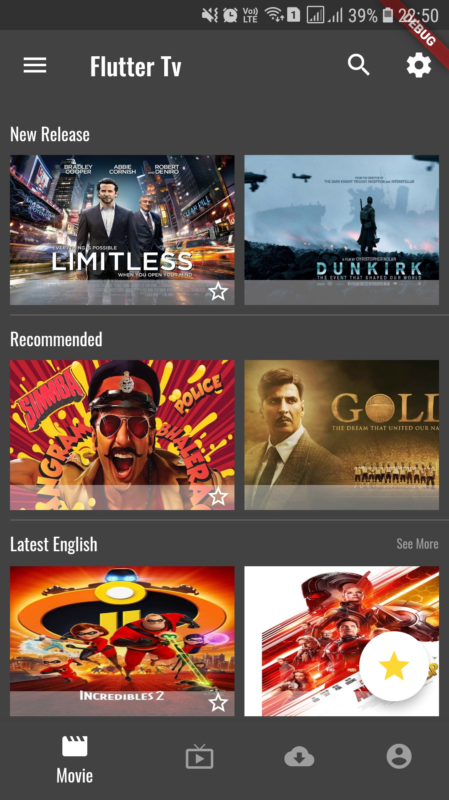

# Flutter TV
The Flutter TV is just a prototype of UI/UX in Flutter with no backend service. You can use the YouTube API to show the trailer/tesars. Happy Hacking!!

### :heart: Star :heart: the repo to support the project or :smile:[Follow Me](https://github.com/AyushBherwani1998).Thanks!

### You will learn: 
1 | 2 | 3 | 4 | 5 
--- | --- | --- | --- | ---
ListView Widget | BottomNavigationBar| Column Widget | Row Widget | Other Basic widget such as Stack 

### Screenshot
### 1

